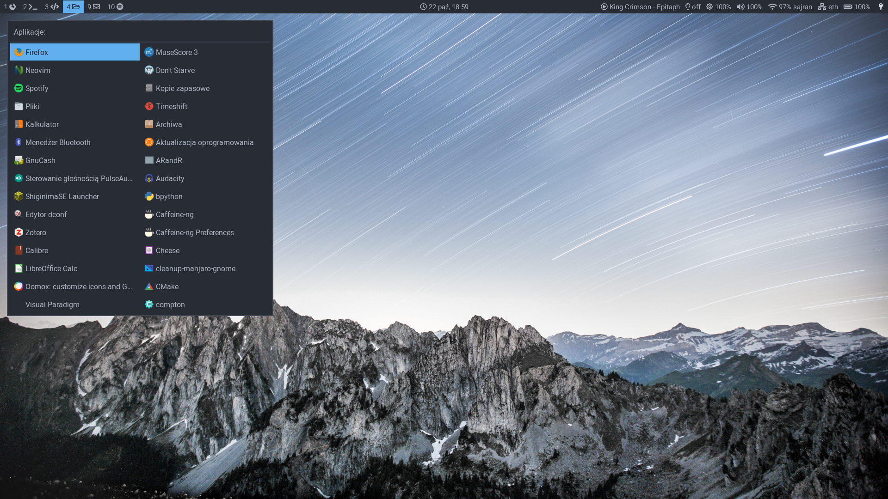
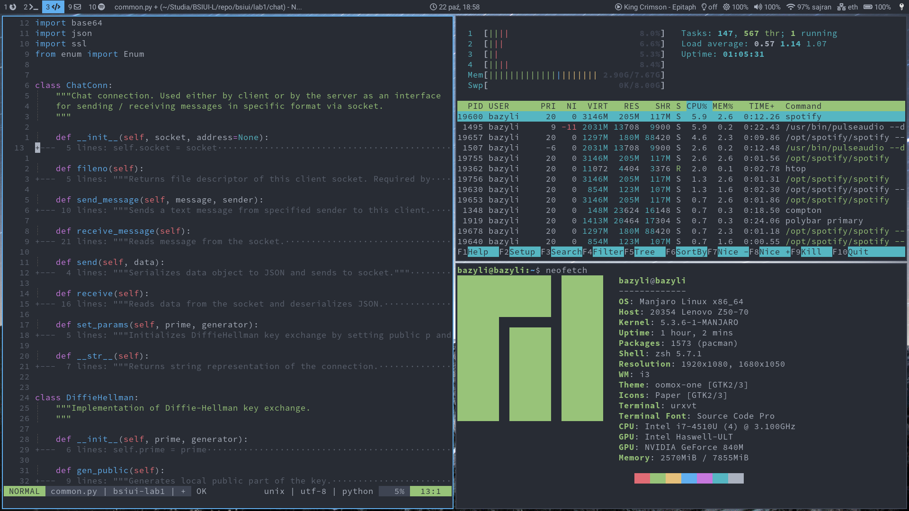
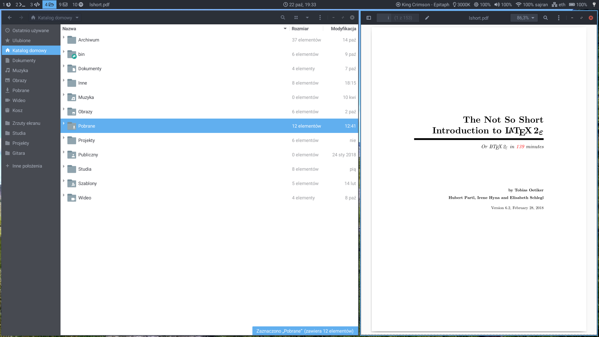

# Dotfiles
Personal setup for i3wm, vim, zsh, tmux and more.

## Usage
These dotfiles are managed using [GNU stow](https://alexpearce.me/2016/02/managing-dotfiles-with-stow/) so you should have it installed.

Start by cloning this repo to your home directory:

    git clone https://github.com/bcyran/dotfiles.git ~/.dotfiles

`cd` to this directory and use `stow` to symlink specific configs, for example:

    cd ~/.dotfiles
    stow i3
    stow polybar
    stow nvim
    ...

## Configs explanation
* `bash` - just `.bashrc` file, can be out of date as I currently use zsh
* `bin` - some scripts
* `dunst` - config and script to set firefox window as urgent on notifications
* `git` - mainly aliases, don't forget to change email and name!
* `i3` - config for i3wm
* `nvim` - `init.vim` and `ftplugin` for neovim
* `oomox` - theme file
* `picom` - compositor config
* `polybar` - config file, launching script, and some custom modules
* `redshift` - just redshift config file
* `rofi` - app menu, power menu
* `shell` - `.aliases` and `.env` files, common for both bash and zsh configs
* `systemd` - systemd `.service` files
* `tmux` - tmux conf and terminfo file fixing some problem I dont even remember
* `urxvt` - URxvt color scheme and other settings
* `zsh` - `.zshrc`, antibody and plugins configs
