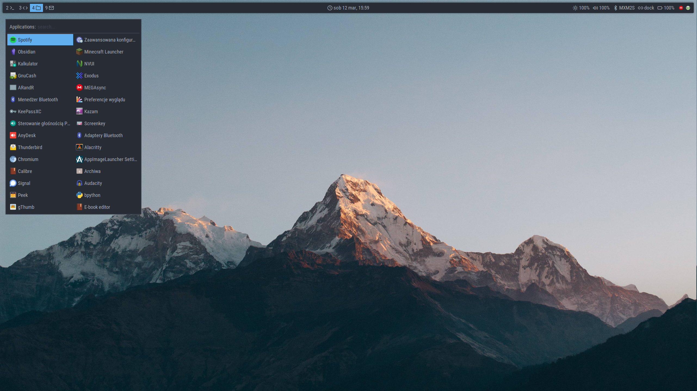
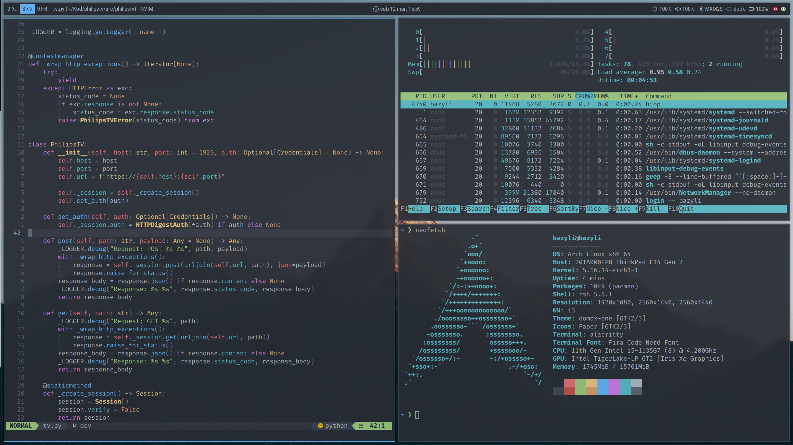

# dotfiles
Personal setup for [i3wm](https://i3wm.org/), [neovim](https://neovim.io/), [zsh](https://zsh.sourceforge.io/), [tmux](https://github.com/tmux/tmux/wiki) and more.
Main OS used is [Arch Linux](https://archlinux.org/).

## Screenshots



## Usage
Those dotfiles are managed using using [chezmoi](https://www.chezmoi.io/).
You can bootstrap this config by installing chezmoi and the dotfiles in a single command:
```shell
sh -c "$(curl -fsLS chezmoi.io/get)" -- init --apply bcyran
```
You probably shouldn't just apply those on your machine if you don't know exactly what you're doing.

## Repo
All dotfiles are stored in this repo's [home](./home) directory.
The names are a bit weird because of the way chezmoi works, but you should be able to figure it out even if your'e not familiar with this.
For instance:
- `private_dot_config` represents `.config` directory,
- `dot_gitconfig.tmpl` is a template which will be used to generate `.gitconfig` file.

## Legacy
Branch [legacy-stow](https://github.com/bcyran/dotfiles/tree/legacy-stow) contains old, legacy dotfiles managed using [GNU Stow](https://www.gnu.org/software/stow/).
This won't be updated anymore, it's just an archive of 3 years and almost 300 commits of learning and tweaking my workspace.
