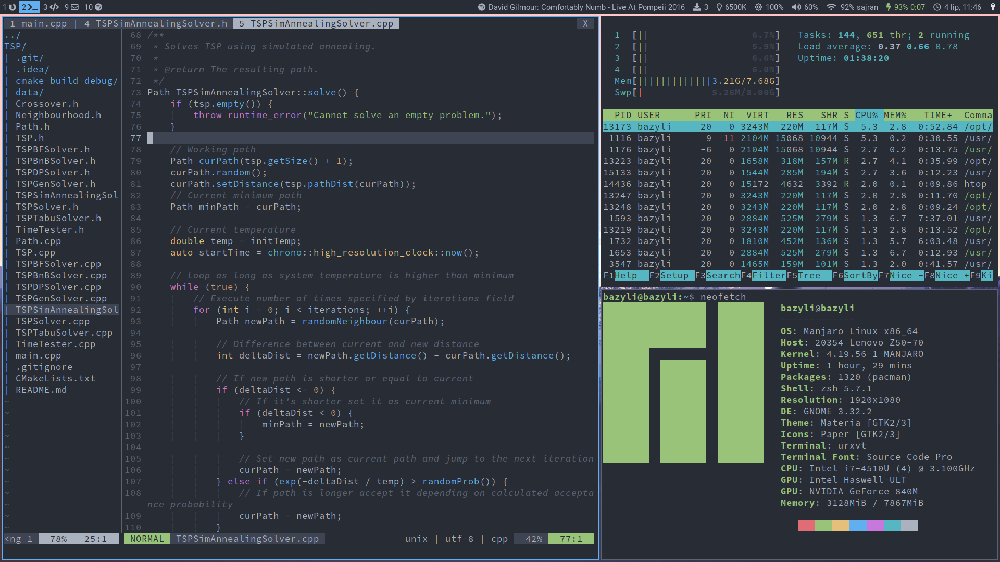

# Dotfiles
Personal setup for i3wm, vim, zsh, tmux and more. I use it with [i3-gnome](https://github.com/jcstr/i3-gnome).

## Usage
These dotfiles are managed using [GNU stow](https://alexpearce.me/2016/02/managing-dotfiles-with-stow/) so you should have it installed.

Start by cloning this repo to your home directory:

    git clone https://github.com/bcyran/dotfiles.git ~/.dotfiles
    
`cd` to this directory and use `stow` to symlink specific configs, for example:

    cd ~/.dotfiles
    stow zsh
    stow vim
    
## Configs explanation
* bash - just `.bashrc` file, can be out of date as I currently use zsh
* bin - some scripts
* git - mainly aliases, don't forget to change email and name!
* i3 - configs for i3wm end everything I use with it, e.g. dunst, py3status, rofi, compton
* redshift - just redshift config file
* shell - `.aliases` and `.env` files, common for both bash and zsh configs
* tmux - tmux conf and terminfo file fixing some problem I dont even remember
* urxvt - URxvt color scheme and other settings
* vim - config for both vim and neovim (symlinked)
* zsh - `.zshrc`, antibody and plugins configs
